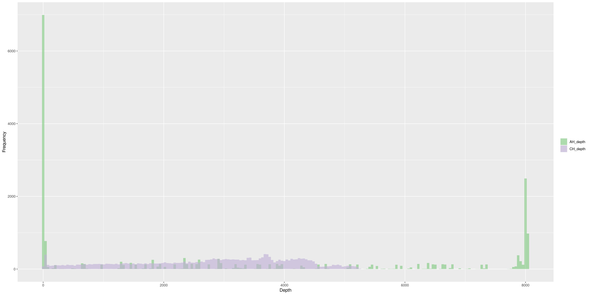
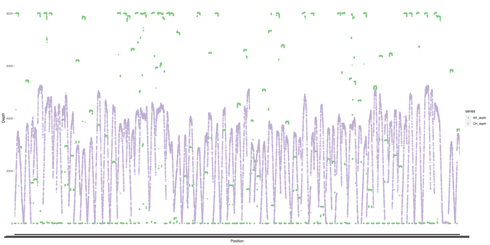

<!--
  %% \VignetteEngine{knitr::knitr}
-->


```{r style, echo = FALSE, include = FALSE, results = 'asis'}
  BiocStyle::markdown()
```


## Overview of the workflow
The given FASTQ files (AH_S1 and CH_S2) were analyzed by a standard analytical pipeline to map the reads to a reference, hg19. The datasets were firstly compared based on the results of [FastQC](https://www.bioinformatics.babraham.ac.uk/projects/fastqc/) following [skewer](https://sourceforge.net/projects/skewer/). The [GATK](https://gatk.broadinstitute.org/hc/en-us) [Picard](https://broadinstitute.github.io/picard/)  resulted in aligned BAM files by sequencing alignment and several post-processing including MarkDuplicates. Lastly, the variations were called by [Mutect2](https://gatk.broadinstitute.org/hc/en-us/articles/360037593851-Mutect2).

```{r echo=FALSE, warning=FALSE,figs, fig.cap="\\label{fig:figs}Figure 1. Schematic of AH_S1 and CH_S2 analysis workflow"}
DiagrammeR::grViz("digraph {
  graph [layout = dot, rankdir = TB]
  
  node [shape = parallelogram, width=0.6, fontname='Arial']        
  parlog [label = 'AH_S1, CH_S2 FASTQ files']
  node [shape = rectangle] 
  subgraph cluster1 {
  
  node [shape=box];
  cl1_1 [label = 'Sequence Alignment\nPicard fastqToBAM']
  
  cl1_2 [label = 'MergeBamAlignment\nMarkDuplicates\nSortSam\nSortAndFixTags\nSetNmMdAndUqTags\nBaseRecalibrator\nApplyBQSR']
  node [shape= parallelogram]
  cl1_3 [label = 'BAM files']
  cl1_1->cl1_3
  }
  subgraph cluster2 {
  node [shape=box]
  rec1 [label = 'Adapter trimming\nskewer']
  rec2 [label = 'Sequecing Read Quality\nFastQC']
  rec1->rec2
  }
  
  rec4 [label = 'Variant calling\nMutect2']
  rec5 [label = 'Genomic variant analysis']
  
  node [shape= parallelogram]
  parlog2[label = 'VCF files']
  
  # edge definitions with the node IDs
  parlog -> rec1
  
  parlog -> cl1_1
  cl1_3 -> rec4 -> parlog2-> rec5
  
}", height = 500)
```  

***


## Sequencing read quality measured by FastQC
The quality of the two datasets were measured by FastQC after trimming adapter sequences from raw FASTQ files. Two files per each dataset were processed and the outputs were summarized in Figure 2. Among 12 QC categories, AH_S1 fails in 4 categories with 1 warning and CH_S2 fails in 2 categories with 3 warnings.   

```{r echo=FALSE, message=FALSE, warning=FALSE, fig2, fig.cap="\\label{fig:figs}Figure 2. Summary of FastQC results"}
library(ngsReports)
qc.files<-list.files(path='fastqc',pattern='fastqc.zip$',full.names=TRUE)
fdl <- FastqcDataList(qc.files)
plotSummary(fdl)+scale_fill_manual(values=c("#FF6B6B", "#F2F26F", "#4ECDC4"))

```

***


## Comparison of aligned sequences (BAM)

### Targeted sequencing data
The output BAM files were analyzed by Picard [CollectTargetedPcrMetrics](https://broadinstitute.github.io/picard/command-line-overview.html#CollectTargetedPcrMetrics) to calculate the PCR based metrics for targeted regions (Table 1)

``` {r echo=FALSE, message=FALSE, warning=FALSE}
library(kableExtra)
source('comp_AH_CH_targeted.R')
TPCR_df %>%
  kbl(caption="Table 1. Collected Targeted PCR metrics of AH_S1 and CH_S2") %>%
  kable_paper() %>%
  scroll_box(width = "100%", height = "500px") 
  

```

### The read depth in commonly targeted regions
Both AH_S1 and CH_S2 targeted regions were calculated by [bedtools](https://bedtools.readthedocs.io/en/latest/content/tools/intersect.html) and used to measure the read depth of those regions in the aligned BAM files by applying [htseq](https://htseq.readthedocs.io/en/release_0.11.1/count.html). The distribution of the read depth is shown in Figure 3 and the read depth of each position is plotted in Figure 4 which prove consitant read depth of CH_S2.   
```{r echo=FALSE, out.width="75%", fig.align='center', fig.cap="Figure 3. Histogram of depths of AH_S1 and CH_S2"}

```
```{r pressure, echo=FALSE, out.width="75%", fig.align='center', fig.cap="Figure 4. Sequencing depth of common regions of AH_S1 and CH_S2"}

```

***

## Variant calling
Those aligned BAM files were used for variant calling compared with hg19 reference as normal tissue sequecing dataset was not given. Mutect2 identified 101 and 219 variation locations for AH_S1 and CH_S2 respectively and 25 of them is common (Figure 5). The common variant calls were annotated by [VEP](http://grch37.ensembl.org/info/docs/tools/vep/index.html) and Table 2 highlights nonsynonymous mutations involving mutational hotspots or [Cancer Hotspots](https://www.cancerhotspots.org/#/home).


``` {r echo=FALSE, message=FALSE, warning=FALSE, fig.align='center', fig.cap="\\label{fig:figs}Figure 5. Overlaps of variant calls between AH_S1 and CH_S2 samples"}
source('summarize_mut_calls.R')
knitr::include_graphics("AH_CH_vcf_venn_diagramm.png")
```

``` {r echo=FALSE, message=FALSE, warning=FALSE}
library(kableExtra)
common_mut<-read.table('AH_CH_common_mutation_calls.txt',header=T)
#knitr::kable(common_mut, format='html',caption='Table. Mutations commonly detected in AH_S1 and CH_S2')
common_mut %>%
  kbl(caption = "Table 2. Nonsynonymous mutation calls among commonly detected in AH_S1 and CH_S2") %>%
  kable_styling()
```

***

## Conclusion
This report shows the workflow to analyze two different NGS library sequencing results. Overall, CH_S2 could be a better choice than AH_S1 considering the sequecing quality, consistency of read depth and also extent of variation calls.     


## Session Information
The Rmd file of this report and source codes are available in my repository [github](https://github.com/suns-chung/SG_task).
```{r}
sessionInfo()
```
